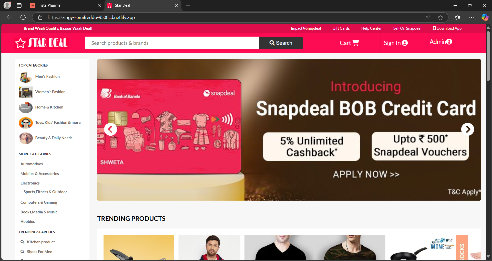

# 🚀 Snapdeal Clone  

A collaborative **Snapdeal Clone** project built in just 7 days by a team of 5 members. This project simulates an e-commerce platform, focusing on essential functionalities and responsive design.  

## 🛠️ Tech Stack  
- **HTML5**: For structuring web pages.  
- **CSS3**: For styling and layout.  
- **Vanilla JavaScript**: For interactivity and Fetch API integration.  

## 📑 Features  
1. **API Integration**  
   - POST/DELETE functionality for seamless data handling.  
2. **Pagination**  
   - Smooth navigation across product listings.  
3. **User Authentication**  
   - Login, Logout, and Sign-Up functionalities.  
4. **Admin & User Controllers**  
   - Admins can manage product listings, while users can explore and interact with the platform.  
🤝 Collaboration
This project was a collaborative effort built by a team of 5 members over a week.

🌟 What I Learned
API integration with POST/DELETE methods.
Implementing pagination for large datasets.
Building user authentication from scratch.
Responsive design for better UX across devices.

📸 Screenshots
### Star Deal Page  


📧 Feedback
Feel free to open issues or suggest improvements!

# 📂 File Structure - Snapdeal Clone  

This repository contains all the files required for the **Snapdeal Clone** project. Below is the detailed file structure for better understanding:  

## 🗂️ Root Directory  
```plaintext
Snapdeal-Clone/
│
├── README.md           # Project documentation  
├── index.html          # Homepage of the website  
├── index.css           # Stylesheet for the homepage  
├── index.js            # Script for the homepage  
├── logo.PNG            # Logo used in the project  
├── name.PNG            # Placeholder or icon image  
└── a_des.png.png       # Additional descriptive image  
📂 Admin Section
plaintext
Copy code
admin/
├── adcos.html          # Admin dashboard for cost management  
├── adcos.css           # Stylesheet for adcos.html  
├── adcos.js            # Script for adcos.html  
├── admanage.html       # Admin manage page  
├── amange.css          # Stylesheet for admin manage page  
├── amange.js           # Script for admin manage page  
├── admdesh.html        # Admin dashboard home  
├── adproduct.html      # Admin product management page  
├── aproduct.css        # Stylesheet for admin product management  
├── aproduct.js         # Script for admin product management  
├── adminlogin.html     # Admin login page  
├── alogin.css          # Stylesheet for admin login page  
├── alogin.js           # Script for admin login page  
📂 User Section
plaintext
Copy code
user/
├── signin.html         # User Sign-in page  
├── signup.html         # User Sign-up page  
├── login.css           # Stylesheet for user login and sign-up  
├── login.js            # Script for user login and sign-up  
├── register.css        # Stylesheet for the registration page  
├── register.js         # Script for registration page  
├── products.html       # Product listing page  
├── products.css        # Stylesheet for product listing  
├── products.js         # Script for product listing  
├── products1.html      # Secondary product listing  
├── products1.js        # Script for secondary product listing  
├── singleproduct.html  # Single product details page  
├── perview.html        # Product preview page  
├── perview.css         # Stylesheet for product preview  
├── perview.js          # Script for product preview  
📂 Cart and Checkout Section
plaintext
Copy code
cart/
├── cart.css            # Stylesheet for cart page  
├── checkout.html       # Checkout page  
├── checkout.css        # Stylesheet for checkout page  
├── checkout.js         # Script for checkout page  
├── payments.html       # Payment page  
├── payments.css        # Stylesheet for payments page  
├── payments.js         # Script for payments page  
├── thankyou.html       # Thank you page after successful checkout  
🌟 Summary
This structure ensures modular organization, separating admin, user, and other sections for maintainability and scalability. Each component has dedicated HTML, CSS, and JavaScript files for seamless functionality.

🚀 How to Use
Clone the repository:
bash
Copy code
git clone https://github.com/subha20032007/Stardeal.com.git
Open index.html to explore the homepage.
Navigate to other HTML files for different features and functionalities.

🙌 Acknowledgment
This project was assigned by Masai School as part of a full-stack web development curriculum.
